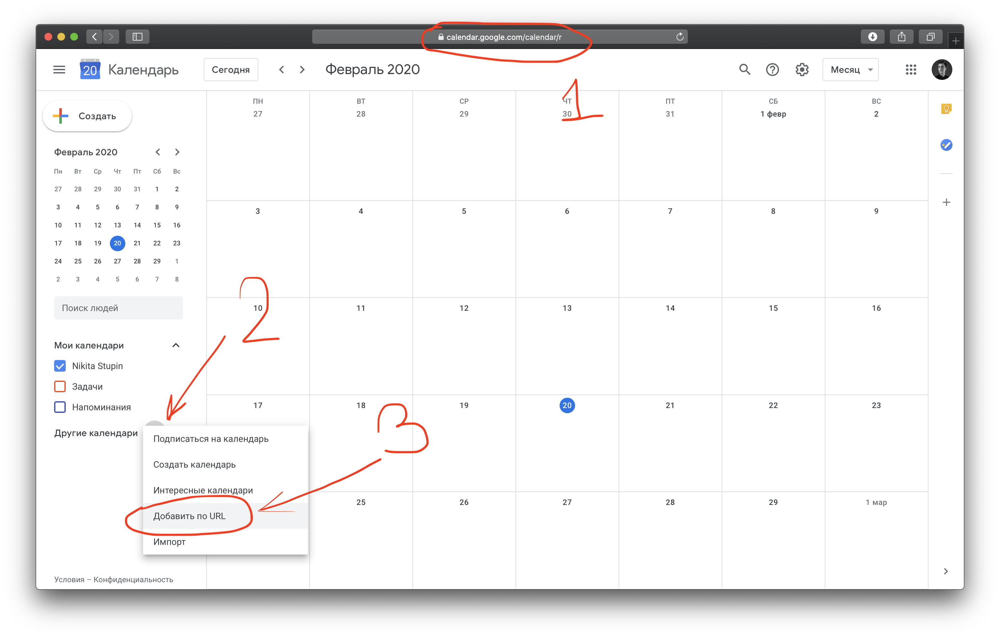
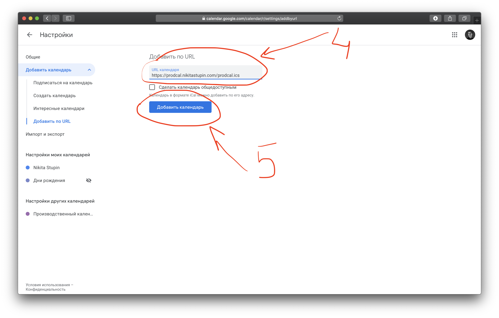

# Как использовать?

Ссылка на подписной календарь: https://prodcal.nikitastupin.com/prodcal.ics

### Настройка подписного календаря на iOS


### Настройка подписного календаря на MacOS

В приложении Календарь: Файл -> Новая подписка на календарь... -> Ввести ссылку выше

### Настройка подписного календаря в Android

Похоже через Google Calendar на телефоне не получится подписаться, поэтому смотри пункт `Настройка подписного календаря в Google Calendar`.

### Настройка подписного календаря в Google Calendar

Переходим на `calendar.google.com`, выбираем `Добавить по URL`:


В поле `URL календаря` вводим `https://prodcal.nikitastupin.com/prodcal.ics`, нажимаем `Добавить календарь`:



Все! :)

## Как поднять у себя на сервере

1. Установить необходимые модули для Python:
```
$ pip3 install -r requirements.txt
```
1. Настроить автообновление календаря:
```
$ crontab -l
0 1 * * * python3 /home/ubuntu/prodcal_ics.py --start-year=2018 -o /home/ubuntu/www/prodcal.ics
```
1. Отдавать файл любым сервером prodcal.ics (например, nginx)

## Разработка

https://icalendar.org/validator.html
